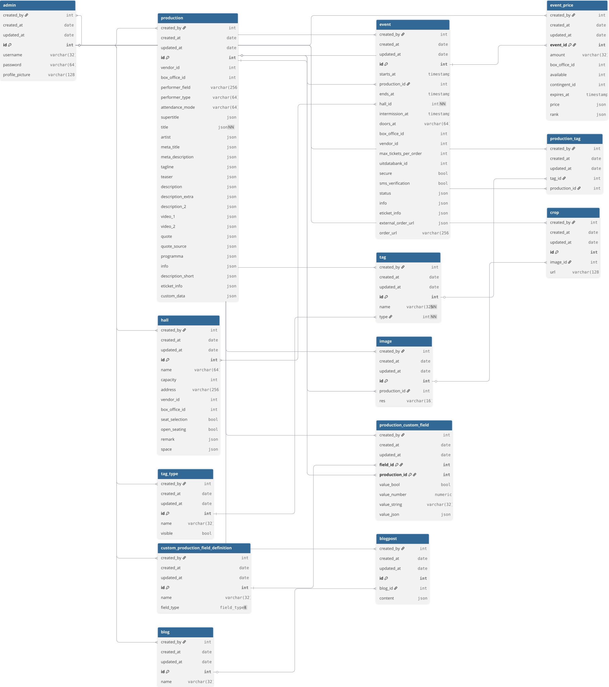

## Database Schema (EER)

##### (Deze documentatie is gegenereerd op basis van het live PostgreSQL-schema. Er kunnen kleine inconsistenties bestaan tussen EER en de externe VIERNULVIER API — de API is de bron van waarheid voor vendor-data.)

Bekijk het schema visueel op https://dbdiagram.io/d/viernulvier-699b2e45bd82f5fce26f02d4 of download de svg: 
De DBML-code vind je hieronder terug.

### Uitleg

#### Production-Event-Hall
De database volgt een parent-child model. Een `production` bevat de vaste informatie over een voorstelling (titel, beschrijving, artiest, media). Een `event` is een specifieke instantie van die voorstelling op een bepaald tijdstip in een bepaalde `hall` (zaal). Eén productie kan meerdere events hebben, bv. een theatervoorstelling die drie avonden speelt. `event.production` is nullable (een event kan bestaan voor het aan een productie gekoppeld wordt), terwijl `event.hall` verplicht is.

#### Meertaligheid via JSON
Alle inhoudelijke tekstvelden (titel, beschrijvingen, info, namen van zalen/tags/blogs, ...) zijn `jsonb`-kolommen die meertalige waarden bevatten: `{nl: "...", en: "..."}`. Historische data uit de CSV-import (2006–2018) zal vaak enkel een NL-waarde bevatten.

#### Metadata via inheritance
Elke content-tabel erft van een gedeelde `metadata` parent-tabel (PostgreSQL `INHERITS`), die `created_at`, `updated_at`, `created_by` en `updated_by` voorziet. Zo is op elk record traceerbaar wie het heeft aangemaakt en wanneer het laatst is aangepast. De `crop`-tabel erft **niet** van `metadata` — in plaats daarvan declareert ze dezelfde vier kolommen rechtstreeks, omdat crops samen met afbeeldingen op het storage-niveau beheerd worden in plaats van via het CMS.

#### Tagging en reeksen
Tags categoriseren producties en bundelen ze tot reeksen. Elke `tag` hoort bij een `tag_type` (bv. "genre", "festival", "reeks") zodat de frontend onderscheid kan maken tussen verschillende soorten tags. Zichtbaarheid wordt per tag ingesteld via de `public` boolean (`false` = enkel CMS, `true` = zichtbaar op de publieke front-end). De relatie tussen producties en tags is veel-op-veel via de tussentabel `production_tag`: één productie kan meerdere tags hebben, en één tag kan bij meerdere producties horen. Een tagnaam is uniek binnen zijn `tag_type` (`unique_tag_per_type`).

#### Deduplicatie via old_id
`production`, `event`, `event_price`, `hall`, `image`, `crop` en `tag` hebben een `old_id` (UNIQUE). `old_id` verwijst naar de primary key van hetzelfde record in zijn bronsysteem — ofwel het oude archief (voor de historische CSV-import, 2006–2018) ofwel de externe VIERNULVIER ticketing-API (voor de scraper). Zowel de legacy importer als de scraper gebruiken `old_id` als dedup-sleutel: voor een record wordt ingevoegd, wordt eerst opgezocht op `old_id` en overgeslagen als het al bestaat, waardoor een re-run nooit duplicaten produceert. `production`, `event` en `event_price` hebben daarnaast een `vendor_id` — het ID uit de VIERNULVIER API — maar dat is enkel als referentie opgeslagen en wordt **niet** als dedup-sleutel gebruikt; deduplicatie gebeurt uitsluitend op `old_id`.

#### Event_price
Prijsinformatie wordt per event opgeslagen in een aparte tabel, met velden zoals bedrag, beschikbaarheid, prijs (meertalig jsonb) en vervaldatum. Eén event kan meerdere price-rijen hebben (bv. standaard / kortingstarief / -26).

#### Image en Crop
Media-opslag is opgesplitst in twee tabellen. `image` is het originele beeld gekoppeld aan een productie. `crop` is een specifieke bijgesneden versie van dat beeld (bv. `hd_ready`, `FE3_header`) met een URL en een `type`-label. De URL moet een pad onder `/media/crops/` zijn (afgedwongen door de `is_path` CHECK-constraint). Zo kunnen meerdere crops per afbeelding bestaan zonder duplicatie van metadata.

#### Custom production fields
Een systeem voor dynamische extra velden op producties:
- `custom_production_field_definition` definieert een extra veld (naam + type) waarbij `type` één van de enum `field_types` is (`number`, `string`, `bool`, `json`). Een `UNIQUE (id, type)` constraint laat toe dat het type vanuit `production_custom_field` als composite FK gerefereerd wordt.
- `production_custom_field` slaat de waarde op voor een (definitie, productie) paar. Het heeft vier getypeerde value-kolommen (`value_bool`, `value_number`, `value_string`, `value_json`) en een `check_data_type` CHECK-constraint die afdwingt dat exact één ervan ingevuld is, én dat die overeenkomt met `type`.

Dit biedt flexibiliteit om later nieuwe velden toe te voegen zonder het schema aan te passen.

#### Admin
Een tabel voor CMS-gebruikers met inloggegevens. Het wachtwoord wordt gehashed opgeslagen (bcrypt, 72 chars). `profile_picture_url` wordt gevalideerd door de `is_url` CHECK-constraint (moet matchen op een `http(s)://…` URL). De `super` boolean markeert een super admin, die andere admins kan opvragen, aanmaken, bewerken of verwijderen. De `created_by` / `updated_by` verwijzingen in de geërfde `metadata`-kolommen koppelen elke wijziging in de databank aan de admin die ze uitvoerde (op NULL gezet wanneer de admin verwijderd wordt).

#### Blog, Blogpost en Production_blogpost
De blogfunctionaliteit bestaat uit een `blog` als container en individuele `blogpost`s met meertalige `title` en `content` (jsonb) en een optionele `published_at` timestamp. De tussentabel `production_blogpost` laat toe dat één blogpost gelinkt wordt aan meerdere producties (en omgekeerd), zodat een redactionele blogpost om het even welke productie uit het archief kan referencen.

#### Migrations
De `migrations`-tabel wordt beheerd door de migration runner (zie `backend/migrations/`) en houdt bij welke genummerde `.sql`-bestanden zijn toegepast. Ze maakt geen deel uit van het applicatie-datamodel.


### DBML code
```dbml
// Use DBML to define your database structure
// Docs: https://dbml.dbdiagram.io/docs

TablePartial metadata {
  "created_by" int [ref: > admin.id, null]
  "created_at" timestamptz
  "updated_by" int [ref: > admin.id, null]
  "updated_at" timestamptz
}

Enum field_types {
  "number"
  "string"
  "bool"
  "json"
}

Table admin {
  ~metadata
  "id" int [PK]
  "username" varchar(32) [unique, not null]
  "password" varchar(72) [not null]
  "profile_picture_url" varchar(2048) // CHECK: must match http(s) URL pattern
  "super" bool [default: false, not null]
}

Table production {
  ~metadata
  "id" int [PK]
  "vendor_id" int
  "box_office_id" int
  "performer_field" varchar(256)
  "performer_type" varchar(64)
  "attendance_mode" varchar(64)
  "supertitle" json
  "title" json [not null]
  "artist" json
  "meta_title" json
  "meta_description" json
  "tagline" json
  "teaser" json
  "description" json
  "description_extra" json
  "description_2" json
  "video_1" json
  "video_2" json
  "quote" json
  "quote_source" json
  "programme" json
  "info" json
  "description_short" json
  "eticket_info" json
  "custom_data" json
  "old_id" int [unique]
  "finalized" bool [default: false]
}

Table hall {
  ~metadata
  "id" int [PK]
  "name" json [not null]
  "address" varchar(256)
  "old_id" int [unique]
}

Table event {
  ~metadata
  "id" int [PK]
  "production" int [ref: > production.id] // ON DELETE CASCADE
  "hall" int [ref: > hall.id, not null]   // ON DELETE RESTRICT
  "starts_at" timestamptz
  "ends_at" timestamptz
  "intermission_at" timestamptz
  "doors_at" timestamptz
  "box_office_id" int
  "vendor_id" int
  "max_tickets_per_order" int
  "uitdatabank_id" int
  "secure" bool
  "sms_verification" bool
  "status" json
  "info" json
  "eticket_info" json
  "external_order_url" json
  "order_url" varchar(256)
  "old_id" int [unique]

  indexes {
    (hall, starts_at)   // idx_event_hall_starts_at
    (production, id)    // idx_event_production_id
  }
}

Table event_price {
  ~metadata
  "id" int [PK]
  "event" int [ref: > event.id] // ON DELETE CASCADE
  "amount" varchar(32)
  "box_office_id" int
  "available" int
  "contingent_id" int
  "expires_at" timestamptz
  "price" json
  "rank" json
  "old_id" int [unique]
}

Table tag_type {
  ~metadata
  "id" int [PK]
  "name" json [unique, not null]
}

Table tag {
  ~metadata
  "id" int [PK]
  "name" json [not null]
  "public" bool [default: false, not null] // false = enkel CMS, true = publieke front-end
  "tag_type" int [ref: > tag_type.id, not null] // ON DELETE CASCADE
  "old_id" int [unique]

  indexes {
    tag_type                    // idx_tag_tag_type
    (name, tag_type) [unique]   // unique_tag_per_type
  }
}

Table production_tag {
  ~metadata
  "production" int [PK, ref: > production.id] // ON DELETE CASCADE
  "tag"        int [PK, ref: > tag.id]        // ON DELETE CASCADE

  indexes {
    tag   // idx_prod_tag_tag
  }
}

Table image {
  ~metadata
  "id" int [PK]
  "production" int [ref: > production.id, not null] // ON DELETE CASCADE
  "res" varchar(16)
  "old_id" int [unique]

  indexes {
    production   // idx_image_production
  }
}

Table crop {
  // crop erft NIET van metadata, maar declareert dezelfde vier kolommen rechtstreeks
  "id" int [PK]
  "image" int [ref: > image.id, not null] // ON DELETE CASCADE
  "url" varchar(2048) [not null]           // CHECK: moet matchen op ^/media/crops/.+$
  "type" varchar(32) [not null]
  "created_by" int [ref: > admin.id, null]
  "created_at" timestamptz
  "updated_by" int [ref: > admin.id, null]
  "updated_at" timestamptz
  "old_id" int [unique]

  indexes {
    image   // idx_crop_image
  }
}

Table custom_production_field_definition {
  ~metadata
  "id" int [PK]
  "name" varchar(64) [not null]
  "type" field_types [not null]

  indexes {
    (id, type) [unique]   // unique_type_per_id — laat composite FK toe vanuit production_custom_field
  }
}

Table production_custom_field {
  ~metadata
  "field_definition_id" int [PK]
  "production"          int [PK, ref: > production.id] // ON DELETE CASCADE
  "type" field_types [not null]
  "value_bool"   bool
  "value_number" numeric
  "value_string" text
  "value_json"   json

  // Composite FK: (field_definition_id, type) -> custom_production_field_definition(id, type), ON DELETE CASCADE
  // CHECK check_data_type: exact één value_* kolom is non-null, overeenkomstig met `type`.
  indexes {
    production   // idx_pcf_production
  }
}

Table blog {
  ~metadata
  "id" int [PK]
  "name" json [not null, default: `'{}'`]
  "description" json
}

Table blogpost {
  ~metadata
  "id" int [PK]
  "blog" int [ref: > blog.id, not null]  // ON DELETE CASCADE
  "title" json [not null, default: `'{}'`]
  "content" json [not null, default: `'{}'`]
  "published_at" timestamptz

  indexes {
    blog   // idx_blogpost_blog
  }
}

Table production_blogpost {
  ~metadata
  "production" int [PK, ref: > production.id] // ON DELETE CASCADE
  "blogpost"   int [PK, ref: > blogpost.id]   // ON DELETE CASCADE

  indexes {
    blogpost   // idx_production_blogpost_blogpost
  }
}
```
